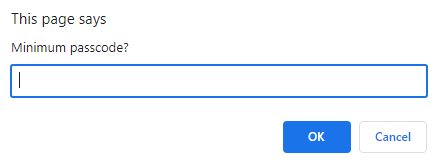
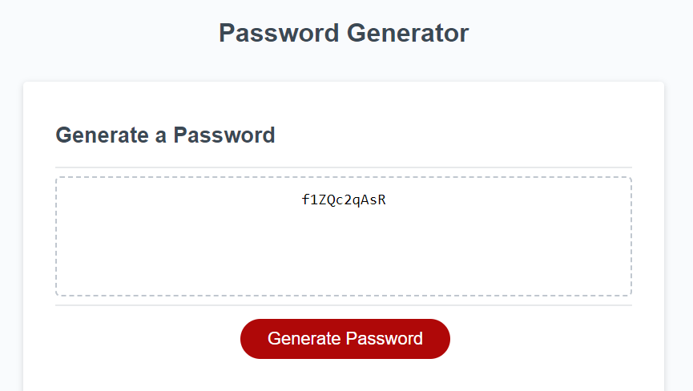
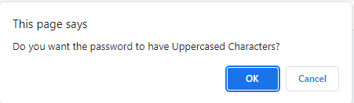

# Password Creator

## User Story

```
AS AN employee with access to sensitive data
I WANT to randomly generate a password that meets certain criteria
SO THAT I can create a strong password that provides greater security
```

## Acceptance Criteria

```
GIVEN I need a new, secure password
WHEN I click the button to generate a password
THEN I am presented with a series of prompts for password criteria
WHEN prompted for password criteria
THEN I select which criteria to include in the password
WHEN prompted for the length of the password
THEN I choose a length of at least 8 characters and no more than 128 characters
WHEN asked for character types to include in the password
THEN I confirm whether or not to include lowercase, uppercase, numeric, and/or special characters
WHEN I answer each prompt
THEN my input should be validated and at least one character type should be selected
WHEN all prompts are answered
THEN a password is generated that matches the selected criteria
WHEN the password is generated
THEN the password is either displayed in an alert or written to the page
```

## Description
```
In the task of making a random password generator I at first struggled to figure out how to best randomise the characters especially when the user gets to
specifically select what type of characters can be withing it and not in it as well as making the password able to be with a range of 8 - 126 characters.

I made it so that when the user presses the button window confirms pop up asking if the user would like this character within the password cycling through 
the options then another prompt asking how many characters the user would like. Once all the window prompts are done it'll then generate a password that fits
the criteria given to the code by the user all though I have yet to make it so that the password will garentee have each different character from every list the
user had selected.
```

## Images
```md




```

## Links
```md
Website: [Link text](https://christopher-va.github.io/Password-Creator/)
Github: [Link text](https://github.com/Christopher-VA/Password-Creator)
```

